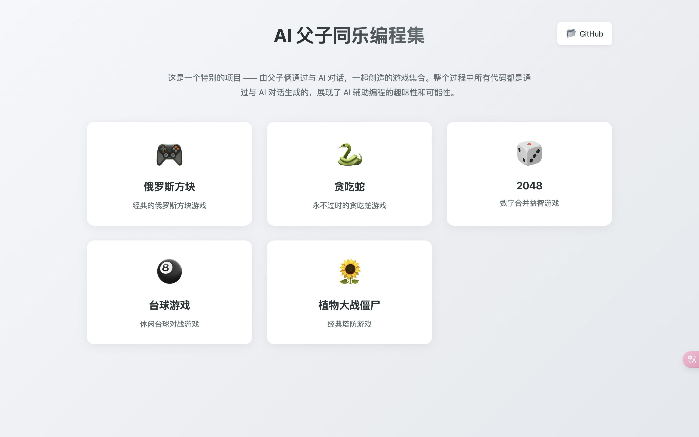

# AI 父子同乐编程集

这是一个特别的项目 —— 由父子俩通过与 AI 对话，一起创造的游戏集合。整个过程中所有代码都是通过与 AI 对话生成的，没有手动编写或修改任何代码，展现了 AI 辅助编程的趣味性和可能性。

## 项目特色

- 🎮 纯 AI 生成的趣味小游戏
- 👨‍👦 父子互动的编程学习体验
- 🤖 完全通过 AI 对话实现
- 🎯 零代码基础也能创造游戏

## 在线体验

您可以直接访问我们的在线演示网站来体验所有游戏：

🎮 [AI 父子同乐编程集](https://ai-games-rho.vercel.app/)

## 项目截图

## 游戏列表

- 贪吃蛇：一个经典的贪吃蛇游戏，通过键盘控制蛇的移动，吃掉食物并避免撞到墙壁或自己的身体。[立即试玩](https://ai-games-rho.vercel.app/贪吃蛇/index.html)（2025-01-08）
- 2048：一个经典的数字游戏，通过滑动数字方块来合并相同的数字，直到达到 2048。[立即试玩](https://ai-games-rho.vercel.app/2048/index.html)（2025-01-09）
- 台球游戏：一个模拟台球的游戏，通过鼠标控制球杆击球，将球打入洞中。[立即试玩](https://ai-games-rho.vercel.app/台球游戏/index.html)（2025-01-10）
- 植物大战僵尸：一个经典的塔防游戏，通过种植植物来抵御僵尸的进攻。[立即试玩](https://ai-games-rho.vercel.app/植物大战僵尸/index.html)（2025-01-12）
- 俄罗斯方块：一个经典的俄罗斯方块游戏，通过键盘控制方块的移动和旋转，消除满行。[立即试玩](https://ai-games-rho.vercel.app/俄罗斯方块/index.html)（2025-01-13）
- 扫雷：一个经典的扫雷游戏，通过点击格子来找出所有非地雷的方块，避免触碰地雷。5 是标 🚩 快捷键[立即试玩](https://ai-games-rho.vercel.app/扫雷/index.html)（2025-01-15）
- 五子棋：一个经典的双人对战游戏，在 19×19 的棋盘上轮流落子，先将五颗棋子连成一线的一方获胜。[立即试玩](https://ai-games-rho.vercel.app/五子棋/index.html)（2025-01-16）
- 四子棋：一个经典的双人对战游戏，在 7×6 的棋盘上轮流落子，先将四颗棋子连成一线的一方获胜。[立即试玩](https://ai-games-rho.vercel.app/四子棋/index.html)（2025-02-06）

## 创作过程

本项目的所有内容都是通过以下方式创建：

1. 父子讨论游戏创意
2. 与 AI 进行对话
3. AI 生成相应代码
4. 直接运行测试

没有任何手动代码编写或修改的环节，展示了 AI 时代编程的新可能。

## 项目目的

- 培养孩子对编程的兴趣
- 体验 AI 辅助创作的乐趣
- 增进父子互动
- 探索零基础编程的可能性
- 培养孩子解决问题的能力
- 培养孩子表达能力

## 技术栈

所有游戏都使用简单易懂的技术构建：

- HTML
- CSS
- JavaScript
- [其他用到的技术]

## 如何尝试

1. 克隆项目到本地
2. 打开对应游戏的 HTML 文件
3. 开始享受游戏乐趣！

## 启发

这个项目证明了：

- 编程学习可以很有趣
- AI 可以降低编程门槛
- 亲子互动可以与技术学习结合
- 创造力不受技术限制

## 联系方式

如果您也对 AI 辅助编程或亲子编程感兴趣，欢迎交流：

- [您的联系方式]

## 特别感谢

感谢参与这个项目的 AI 助手们，让这个有趣的父子编程之旅成为可能。
